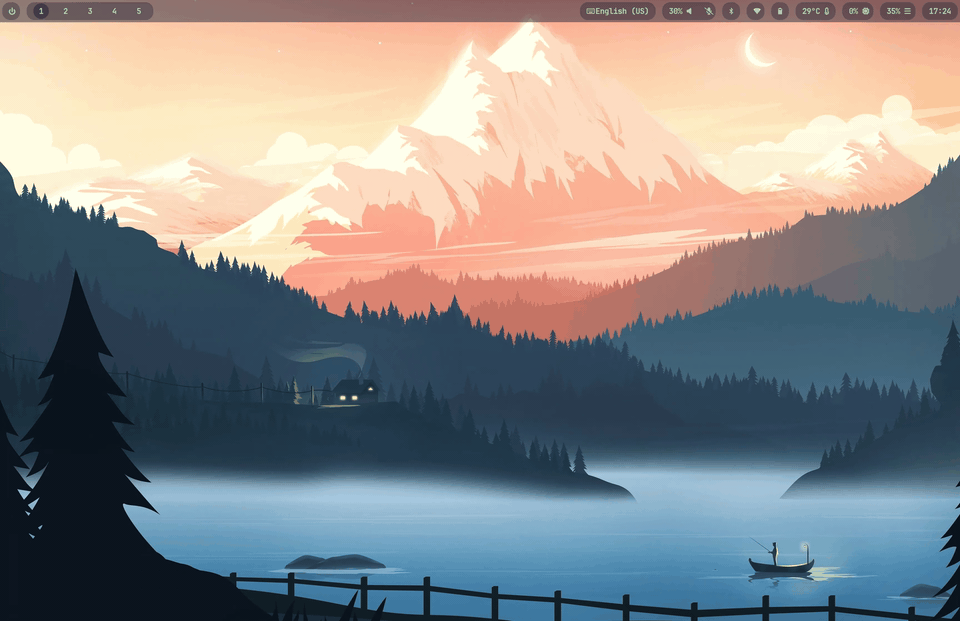

# aurevoir 🌙


[](https://goreportcard.com/report/github.com/leolorenzato/aurevoir)


**aurevoir** is a **TUI power menu** written in Go with [Bubble Tea](https://github.com/charmbracelet/bubbletea).



### ✨ Features
- ⚙️ Configurable commands
- 🎨 Theme customization

### 🔧 Build from Source
- check Go version (requires **Go 1.25+**)
    ```bash
    go version
    ```

- build the app
    ```bash
    git clone git@github.com:leolorenzato/aurevoir.git
    cd ./aurevoir
    go build -o ./bin/aurevoir ./cmd/app
    ```

### 🚀 Run
- run the app
    ```bash
    ./bin/aurevoir
    ```

## 🧩 Configuration

### Default
See the [configuration template](https://github.com/leolorenzato/aurevoir/blob/main/config.template.toml)

### Custom
- create a config file (e.g `~/.config/aurevoir/config.toml`) by copying the default configuration and customizing it
- run the app
    ```bash
    ./bin/aurevoir -c path/to/config.toml
    ```

## Hyprland
### Configuration
In the Hyprland ecosystem you tipically use [hyprlock](https://wiki.hypr.land/Hypr-Ecosystem/hyprlock/) and [hyprshutdown](https://wiki.hypr.land/Hypr-Ecosystem/hyprshutdown/). To better integrate with the ecosystem, you can use a custom configuration like the following:
```toml
[items.lock]
icon = ""
cmd = "hyprlock"

[items.shutdown]
icon = ""
cmd = "hyprshutdown --post-cmd 'shutdown -P 0'"

[items.reboot]
icon = ""
cmd = "hyprshutdown --post-cmd 'reboot'"

[items.logout]
icon = ""
cmd = "hyprshutdown"
```

### Run
Launch the app (e.g., via a Hyprland keybind or a custom Waybar module).  
Omit `-c` to use the default configuration.  
❗️ The example below uses a terminal emulator that supports window classes.
```text
$TERMINAL --class aurevoir -e aurevoir -c ~/.config/aurevoir/config.toml
```

To center the window and set a fixed size:
```text
windowrule = match:class ^(aurevoir)$, float on, center on, size 550 350
```

## 📄 License
Distributed under [MIT](https://github.com/leolorenzato/aurevoir/blob/main/LICENSE)